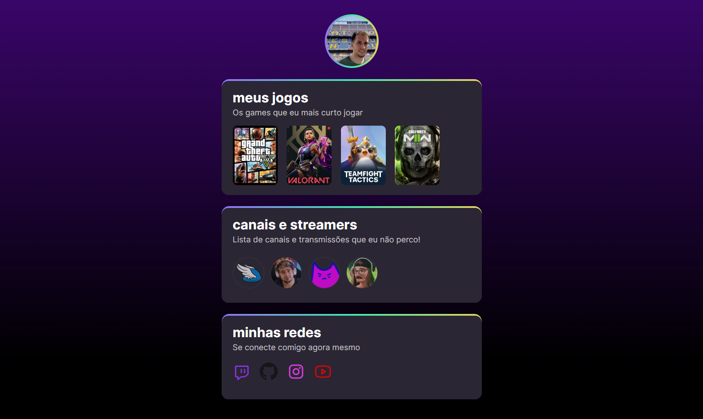

# NLW project

>Trilha explorer

This project is a web page created during the Next Level Week, a series of classes that help newcomers entering the world of programming with HTML/CSS

website [here](https://bpcampos.github.io/NLW)

You can know more about the NLW in: https://app.rocketseat.com.br/event/nlw-09/explorer/abertura

